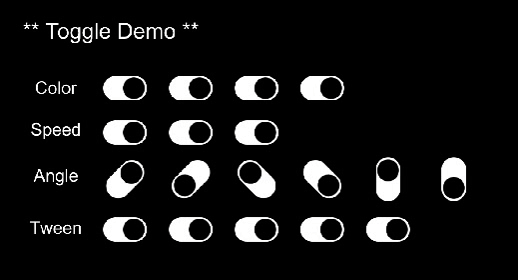

# UI Toggle #

A little bit overkill toggle button UI for Unity Engine. <br/><br/>

## API ##
```
// Check if the toggle is on or off?
bool isOn = this.GetComponent<JCS_Toggle>().IsOn;
```

## Screenshot ##


## Source ##
JCSUnity : https://github.com/jcs090218/JCSUnity
Tweener : https://github.com/PeterVuorela/Tweener by <a href="https://github.com/PeterVuorela">Peter Vuorela</a>
